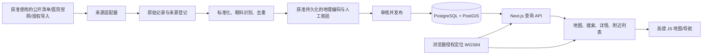

# 全国眼科医疗资源地图：P0 架构设计

状态：P0 设计稿，2026-10-01。范围：独立项目；本阶段不编写生产代码、不采集全国数据、不部署服务。

## 1. 目标、范围与完成定义

产品目标是为大项目提供一个可链接的独立资源页。用户可以浏览全国已发布的眼科医疗机构、搜索和筛选、点击地图点位查看带来源的详情、授权定位后按直线距离查找附近机构，并跳转导航。桌面端采用列表与地图并排，移动端采用地图与可展开列表。地图和列表必须互相定位，详情页有稳定 URL。

数据对象以**实际就诊地点（院区/门诊点）**为单位；同一医院的不同院区分别建记录并关联同一机构。第一期优先眼科专科医院、明确设有眼科的综合医院、公开眼科中心；诊所可进入候选库，但是否公开取决于来源和审核。附近排序只表示地理接近，不代表医疗质量、可预约性或急诊能力。

“全国”是覆盖目标，不是 P5 试点后自动成立的事实。页面必须展示覆盖范围、单条最近核验时间和纠错入口。没有可靠坐标、没有合法来源或眼科服务证据不足的记录不能作为已核验点位发布。

### 可验收的第一期产品

- 地图按可视区域动态加载，低缩放级别返回聚合而非全国点位；点击点位与列表项打开同一详情。
- 用户明确点击“查找附近”后才请求位置权限；拒绝、失败时可手选城市。
- 详情至少展示名称、院区、类型、地址、眼科服务证据、来源、核验日期和导航入口；未知字段不猜测。
- 管理员能导入、审核、合并、退回和撤销发布，并查看原始来源及变更记录。
- 北京、广东试点通过数据质量检查后才扩展全国。

## 2. 现状与设计选择

2026-10-01 检查：当前工作目录为空，不是 Git 仓库，也没有现有大项目代码可复用。因此本设计按独立模块制定，后续通过公开页面 URL 和稳定 API 接入大项目。Next.js、Supabase、部署平台均为拟采用选项，不代表已有账户或密钥。

比较过三条路径：

| 路径 | 优点 | 限制 | 结论 |
| --- | --- | --- | --- |
| 自有、获准使用的数据入库；高德用于前端地图与导航 | 可审计、可长期维护，适合搜索和附近查询 | 逐来源取得使用依据，地理编码是单独依赖 | **采用** |
| 人工维护的小样本地图 | 最快验证交互 | 无法支撑全国覆盖和自动更新 | 可作 UI 验证，不替代数据方案 |
| 采购有批量使用权的医疗数据 | 可能加速覆盖 | 成本与字段授权未知 | 作为后续可替换的数据适配器 |

此前方案把高德地理编码结果直接存入自有医院库；此设计**不默认这样做**。高德开放平台协议对直接存储、缓存或抓取其服务相关内容有限制，且“相关内容”包括地理编码和坐标；如需持久化此类结果，必须先取得覆盖该用途的明确授权。[高德服务协议](https://lbs.amap.com/pages/terms/) 因此持久坐标须来自可持久化的独立来源、获授权的地理编码服务或人工核验；高德的坐标转换只用于地图会话中的展示。商业使用高德前也需核对当前许可和配额。[技术服务许可协议](https://lbs.amap.com/pages/authorization/)

## 3. 系统架构、目录与数据流



拟定目录（P0 只记录结构，不创建代码目录）：

```text
apps/web/app/resources/eye-hospitals/   地图页与详情页
apps/web/app/api/hospitals/             公开查询接口
apps/web/app/admin/                     审核界面
apps/web/components/eye-map/            地图、列表、筛选、详情组件
packages/contracts/                     数据类型与请求/响应契约
services/collector/sources/             按来源隔离的采集适配器
services/collector/pipeline/            标准化、匹配、坐标、核验
services/collector/tasks/               试点和增量任务
db/migrations/                           数据库迁移
docs/data-sources/                       来源登记与使用依据
docs/operations/                         运行、回滚、抽检手册
```

各单元只通过明确契约交换数据：适配器产出 `RawRecord`；流水线产出 `Candidate` 和证据；人工审核决定是否生成或更新 `PublishedFacility`；公开 API 只读取已发布视图。原始记录不可被清洗步骤覆盖，采集任务可重复运行而不产生重复来源行。

## 4. 数据来源接口与采集准入

每个来源先登记 `source_id、机构、URL、覆盖地区、许可/使用依据、允许字段、采集方式、robots/访问限制、请求频率、更新周期、责任人、最后复核日`，审核通过后才能启用适配器。优先可下载的政府公开清单和明确允许使用的机构官网信息，其次为有合同授权的数据导入。国家卫健委网站提供“医院执业登记”查询入口，可用于单条核验；**不能据此假定存在可批量导出的全国数据集**。[国家卫健委数据查询](https://www.nhc.gov.cn/wjw/sjcx/sjcx.shtml)

适配器接口：`discover(region, cursor) -> Page<RawRecord>`；`fetch_detail(ref) -> RawRecord`；`checkpoint() -> Cursor`。`RawRecord` 包含原文、原 URL、抓取时间、HTTP 状态、来源版本及内容散列。CSV/Excel 和人工导入使用同一后续流水线。遇到验证码、登录、明确禁止自动访问、来源不可用或条款不清，适配器停止并生成审核任务；不绕过访问控制。每个来源单独限速、重试和熔断，遵守站点要求并记录抓取日志。

## 5. 数据模型与字段来源

以下是逻辑 Schema；P1 形成可执行 migration。院区维度与多来源证据是核心约束。

| 表 | 核心字段 | 约束/用途 |
| --- | --- | --- |
| `organizations` | `id, canonical_name, registration_id?, ownership_type?` | 可选机构主体；登记号仅在来源可信时填写 |
| `facilities` | `id, organization_id?, name, normalized_name, campus_name?, category, province, city, district, adcode?, address, phone?, website?, hospital_level?, hospital_grade?, ophthalmology_status, verification_status, published_at?, last_verified_at?` | 实际就诊地点；类型为专科医院/综合医院眼科/眼科中心/诊所/待核验；未知值保留 `null` |
| `facility_locations` | `facility_id, lon_wgs84, lat_wgs84, geog_wgs84, coordinate_source_id, accuracy_m?, location_status, verified_at` | 仅持久化获准存储的 WGS84 坐标；坐标异常不可发布 |
| `source_catalog` | `id, name, url, owner, permitted_fields, use_basis, access_policy, status, reviewed_at` | 来源准入和变更记录 |
| `source_records` | `id, source_id, source_key, raw_payload, source_url, collected_at, content_hash, import_run_id` | 原始快照；`source_id + source_key + content_hash` 幂等 |
| `facility_evidence` | `facility_id, source_record_id, field_name, field_value, confidence, reviewed_at?` | 字段级溯源；眼科服务、等级、电话等均有证据 |
| `candidate_records` | `id, source_record_id, parsed_fields, match_status, proposed_facility_id?` | 未发布工作区 |
| `duplicate_cases` | `id, candidate_ids, reason, score, resolution, reviewer_id?, resolved_at?` | 疑似合并人工决策 |
| `import_runs` | `id, source_id, region_code, started_at, ended_at, status, counts, error_summary` | 任务审计和重跑 |
| `audit_events` | `id, actor_id, entity, entity_id, action, before, after, created_at` | 发布、合并、退回、撤销审计 |
| `regions` | `adcode, name, level, parent_adcode, version, valid_from?, valid_to?` | 版本化行政区映射；不能只按名称关联 |

`facilities` 对已发布记录建立地区、分类、标准名索引；`facility_locations.geog_wgs84` 建 GiST 索引；搜索可从 PostgreSQL trigram/full-text 起步，必要时再引入专用搜索服务。Supabase 可启用 PostGIS，官方建议扩展放在独立 schema；`ST_DWithin` 可利用空间索引做半径筛选。[Supabase PostGIS 指南](https://supabase.com/docs/guides/database/extensions/postgis)、[PostGIS 半径查询](https://postgis.net/documentation/tips/st-dwithin/)

## 6. 标准化、去重、坐标和核验流水线

1. **解析与规范化**：统一全半角、空白、常见院区后缀、电话格式和行政区；保留原值。通过证据识别“有眼科”与“眼科专科”，不能仅凭医院名称推断综合医院开设眼科。
2. **候选匹配**：先用可信登记号和院区地址匹配；再用同区划内名称相似度、地址、电话和坐标生成候选。自动合并只用于高置信且无冲突的同院区记录；跨院区、等级冲突、地址冲突交人工。合并记录保留全部来源和回滚日志。
3. **坐标获取**：抽象 `Geocoder` 接口，只有许可允许持久化结果的提供方可写库。地址模糊、多结果、坐标落在错误省市或精度不足时进入人工核验。未核验坐标不能冒充精确点位。
4. **发布审核**：名称、地址、眼科证据、来源可用性、坐标质量全部通过才发布地图点位；缺坐标的记录可只在待核验后台。定期复核失效网页、医院更名、停业和搬迁。
5. **增量更新**：按来源游标、ETag/更新时间或内容散列检测变更，产生字段差异；重要字段变化经审核后发布。失败保留上次已核验版本，并标注过期状态。

`confidence` 只用于数据审核优先级，不对用户展示为“医院质量分”。去重、眼科识别和地理编码分别统计准确率，不把单一总分当作发布依据。

## 7. 坐标系和地图查询

数据库的测距坐标统一为 **WGS84**，用 `geography(Point,4326)` 做米制距离查询。用户位置由浏览器原生 Geolocation 在明确授权后取得，按 WGS84 传给 `/nearby`；桌面定位不准确或失败时提供城市手选。高德地图展示时，在客户端通过高德提供的 `convertFrom(..., 'gps')` 把自己的 WGS84 点临时转换为高德坐标，转换结果不写入数据库。[高德坐标说明](https://lbs.amap.com/api/javascript-api-v2/guide/abc/basetype)、[高德定位说明](https://lbs.amap.com/api/javascript-api-v2/guide/services/geolocation)

地图视窗来自高德坐标，公开 API 接收 `bboxGcj02`。服务端先用**保守扩张的范围**在自有 WGS84 库里筛选候选；客户端转换并裁剪到真实视窗。扩张宽度须在 P7 用边界样本验证，不能假定两个坐标系完全一致。全国/省级缩放默认按地区聚合返回数量；城市级视窗才返回上限明确的点位。请求需防抖、取消过期响应和分页/截断标志，不能将全部院区传给浏览器。`AMap.MarkerCluster` 可做客户端当前视窗点聚合。[高德点聚合文档](https://lbs.amap.com/api/javascript-api-v2/guide/amap-massmarker/marker-cluster)

附近结果是 `ST_DWithin` 范围过滤后按 `ST_Distance` 升序取前 N 条，返回 `distance_m` 与计算时间。默认半径 10 km，允许 3/5/10 km；无结果时提示扩大范围。该距离是**直线距离**，导航页中的路程由地图服务计算，不能混用。

## 8. API Contract 与错误处理

公开 API 用 Next.js App Router Route Handlers，统一 JSON 结构 `{data, meta, error}`；`meta` 包含覆盖区域、更新时间、坐标系和是否截断。Route Handlers 是 App Router 官方支持的 HTTP 接口机制。[Next.js Route Handlers](https://nextjs.org/docs/app/getting-started/route-handlers)

| 接口 | 输入 | 输出/限制 |
| --- | --- | --- |
| `GET /api/hospitals/map` | `bboxGcj02=minLng,minLat,maxLng,maxLat`, `zoom`, `category?`, `adcode?` | 高缩放点位或低缩放聚合；最多 500 点；含 `truncated` |
| `GET /api/hospitals/nearby` | `latWgs84`, `lngWgs84`, `radiusM=3000|5000|10000`, `category?`, `limit<=50` | 已发布机构及直线距离；不记录原始用户坐标 |
| `GET /api/hospitals/search` | `q`, `adcode?`, `category?`, `cursor?` | 名称/院区/城市搜索；20 条一页 |
| `GET /api/hospitals/{id}` | UUID | 详情、来源、核验时间；未发布返回 404 |
| `GET /api/regions` | `parentAdcode?` | 版本化省市区树 |
| `POST /api/admin/imports` | 已授权来源或文件 | 创建导入任务；管理员限定 |
| `GET /api/admin/review` | 状态、来源、地区 | 待审/冲突/缺坐标列表；管理员限定 |
| `POST /api/admin/facilities/{id}/decision` | 发布/退回/合并/撤销及理由 | 审计事件；管理员限定 |

参数错误返回 400、无权限 401/403、限速 429、上游故障 502、内部错误 500；错误码稳定且不暴露密钥、原始 HTML 或用户坐标。前端分别呈现空结果、定位被拒、来源待核验、地图加载失败和网络重试状态。外部官网只允许 `https:` URL，导航链接使用官方 URL 模板并对参数编码。

## 9. 前端组件、管理后台与运行

```text
EyeHospitalsPage
├─ SearchAndFilters（关键词、地区、机构类型、半径）
├─ MapCanvas（高德底图、点位、聚合、当前位置）
├─ FacilityList（同地图视窗联动、可键盘操作）
├─ FacilityDetailPanel（来源、核验日、官网、导航）
└─ LocationControl（权限请求、失败提示、城市手选）
```

移动端列表为底部抽屉，保留可触达搜索和定位按钮。地图点位要有对应可访问列表，筛选与详情不依赖仅用鼠标操作。详情页 `/hospitals/[id]` 可独立分享；项目资源入口 `/resources/eye-hospitals`。页面文字明确“信息供查询，实际门诊与服务请以医院官方信息为准”。

后台按“来源登记 → 原始记录 → 候选 → 重复冲突 → 坐标异常 → 发布审核”流转。只允许已认证管理员写入；公开页面只读已发布视图。任务调度初期使用可审计的定时 Worker；每个来源独立频率、超时、退避和最大重试次数。日志记录任务 ID、来源、批次、阶段、数量、失败原因与耗时，不记录用户精确位置和密钥。失败任务进入重跑队列；重大错误暂停该来源，不阻塞其他来源。

安全边界：密钥仅服务端环境变量，地图浏览器 Key 按域名限制；服务端数据库使用最小权限账号；管理员接口鉴权、CSRF 防护、操作审计；导入文件限制格式/大小并隔离解析；来源 HTML 不直接渲染；日志脱敏。公开查询按 IP/会话限速，视窗面积与 zoom 组合设上限，防止大范围高频抓取。对用户位置仅在请求中短暂处理，不持久化个人定位历史。

## 10. 试点、测试矩阵与质量门槛

P5 选北京、广东是为了覆盖直辖市、跨市、省内不同网站结构；具体批量来源必须先完成准入。试点记录每地区的已知来源、可采字段、许可、预计覆盖对象与无法覆盖的原因，不以“采到了若干条”代替覆盖率。

| 风险 | 验证方式 | 通过标准（初始目标，P5 可按样本修订并记录原因） |
| --- | --- | --- |
| 误把非眼科机构发布 | 分层随机抽检至少 100 条已发布记录，逐条核对眼科证据 | 精确率 ≥ 98%；严重误分类 0 |
| 同院区重复/跨院区误合并 | 抽检自动合并与疑似重复各至少 50 组 | 自动合并误合并 0；跨院区不合并 |
| 地址和点位错误 | 各地区抽检至少 50 个点，核对官网地址及地图落点 | 错城市/区县 0；模糊点不发布 |
| 来源失效和字段冲突 | 模拟网页失效、更名、电话冲突 | 原记录可追溯；冲突进入审核；已发布值不被静默覆盖 |
| 地图性能 | 全国、省、市三级缩放和连续拖动压测 | 不返回全国明细；无过期响应覆盖最新视窗；点位上限生效 |
| 附近查询 | 边界、半径、零结果、拒绝定位测试 | WGS84 测距正确；距离升序；失败可选城市 |
| 权限与安全 | 未授权管理请求、恶意导入、外链、限速测试 | 无越权写入；密钥不暴露；输入被校验 |

P13 做浏览器到 API 到数据库的完整流程测试；导入流水线用固定样本做幂等与回滚测试。生产数据核验以人工抽样为主，不能用只复述处理逻辑的测试替代。

## 11. P1–P14 实施计划

每阶段的文件名是预期落点，实施时按实际技术选型微调；**后续阶段须满足依赖和验收标准后再推进**。

| 阶段 | 目标与实现 | 预期文件 | 测试与验收 | 依赖 |
| --- | --- | --- | --- | --- |
| P1 数据模型 | 建迁移、约束、索引、已发布视图、审核审计表 | `db/migrations/*`, `packages/contracts/*` | 空库迁移/回滚、约束与索引检查通过 | P0、数据库选型 |
| P2 来源框架 | 建来源登记、适配器接口、单个获准来源或授权文件导入 | `services/collector/sources/*`, `docs/data-sources/*` | 单来源断点续跑、幂等、限速、故障停止 | P1、来源准入 |
| P3 ETL | 规范化、眼科证据识别、候选匹配与人工冲突队列 | `services/collector/pipeline/*` | 固定样本可重复；不误合并跨院区 | P2 |
| P4 坐标 | 接入可持久化的坐标提供方、精度和区划校验 | `services/collector/pipeline/geocode*` | 错省市和模糊地址进入待审，不发布 | P3、坐标许可 |
| P5 两地试点 | 北京、广东的已准入来源批量导入和抽检 | `services/collector/tasks/pilot*`, `docs/operations/pilot-*` | 上述抽检门槛、覆盖缺口报告、可回滚 | P4 |
| P6 全国扩展 | 按地区/来源批次运行，保留覆盖与失败清单 | `services/collector/tasks/nationwide*` | 批次可恢复、失败不污染已发布数据 | P5、各来源准入 |
| P7 地图 API | 视窗、聚合、上限、筛选和缓存策略 | `apps/web/app/api/hospitals/map/*` | 边界坐标与连续拖动结果正确、负载达标 | P1、P5 |
| P8 地图 UI | 桌面/移动地图、聚合、列表、详情面板 | `apps/web/components/eye-map/*` | 键盘列表可用、点位/列表联动、窄屏可用 | P7、地图 Key |
| P9 定位附近 | 浏览器授权定位、WGS84 查询、手选城市 | `apps/web/app/api/hospitals/nearby/*`, `LocationControl` | 拒绝/失败/无结果均可继续使用 | P7、P8 |
| P10 搜索详情 | 名称/地区搜索和稳定详情页 | `apps/web/app/api/hospitals/search/*`, `apps/web/app/hospitals/[id]/*` | 搜索分页、未发布 404、来源展示 | P7 |
| P11 管理后台 | 导入、冲突、坐标、发布审核与撤销 | `apps/web/app/admin/*` | 权限隔离、审计可追踪、合并可回滚 | P3、P5 |
| P12 增量任务 | 来源级调度、变更对比、报警与重跑 | `services/collector/tasks/incremental*`, `docs/operations/*` | 模拟失效、变更和重复运行不破坏数据 | P11 |
| P13 综合 QA | 端到端、可访问性、性能、数据抽检 | `tests/e2e/*`, `docs/operations/qa-*` | P5 门槛在扩展样本中保持；关键流程通过 | P6–P12 |
| P14 上线 | 域名、部署、备份、监控、授权复核 | `docs/operations/release-*`, 部署配置 | 预发演练、恢复演练、许可和隐私检查通过 | P13 |

## 12. 尚待决定与推荐 P1

1. **坐标数据许可**：选择允许持久化的地理编码/坐标来源；在确认前 P4 无法发布自动生成的坐标。
2. **首批来源清单**：北京、广东哪些政府清单或医院官网允许采集与再展示，需逐项登记；NHC 查询入口只作核验候选。
3. **商业化与高德许可**：上线模式、预估调用量、浏览器 Key 与服务授权需在 P8/P14 前确定。
4. **大项目接入方式**：目前按独立公开页面和 URL 链接设计；若以后提供大项目仓库，可确定统一登录、导航和视觉规范。
5. **覆盖目标**：全国各地区的可证明分母和优先级要在 P5 之后定义；不能承诺百分之百完整。

**P0 COMPLETE（设计基线）**：已给出架构、数据流、逻辑 Schema、来源与流水线、坐标策略、查询契约、前后端边界、运维安全、试点质量门槛和 P1–P14 计划。此状态只代表设计稿完整，不代表用户最终验收或任何生产能力已实现。推荐 P1：先确认数据库与坐标来源约束，建立可迁移的数据模型和来源登记表。
